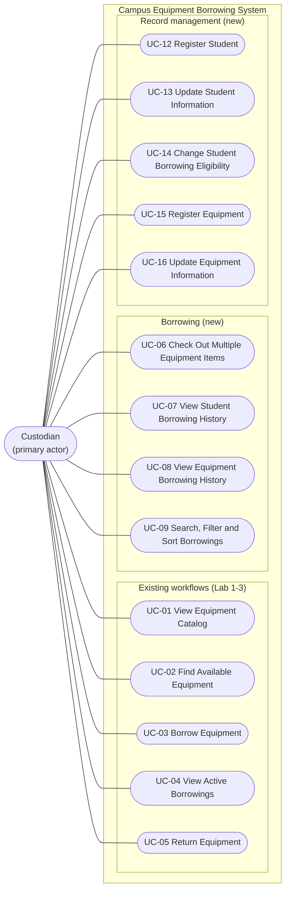

# Use-case diagram (Lab 4 scope)

Primary actor: **Custodian** (laboratory staff). Deferred and future cases are not drawn.
No include/extend arrows are used for internal validation.

```mermaid
flowchart LR
    C(["Custodian<br/>(primary actor)"])

    subgraph SYS["Campus Equipment Borrowing System"]
        direction TB
        subgraph E["Existing workflows (Lab 1-3)"]
            UC01(["UC-01 View Equipment Catalog"])
            UC02(["UC-02 Find Available Equipment"])
            UC03(["UC-03 Borrow Equipment"])
            UC04(["UC-04 View Active Borrowings"])
            UC05(["UC-05 Return Equipment"])
        end
        subgraph B["Borrowing (new)"]
            UC06(["UC-06 Check Out Multiple Equipment Items"])
            UC07(["UC-07 View Student Borrowing History"])
            UC08(["UC-08 View Equipment Borrowing History"])
            UC09(["UC-09 Search, Filter and Sort Borrowings"])
        end
        subgraph M["Record management (new)"]
            UC12(["UC-12 Register Student"])
            UC13(["UC-13 Update Student Information"])
            UC14(["UC-14 Change Student Borrowing Eligibility"])
            UC15(["UC-15 Register Equipment"])
            UC16(["UC-16 Update Equipment Information"])
        end
    end

    C --- UC01 & UC02 & UC03 & UC04 & UC05
    C --- UC06 & UC07 & UC08 & UC09
    C --- UC12 & UC13 & UC14 & UC15 & UC16
```
